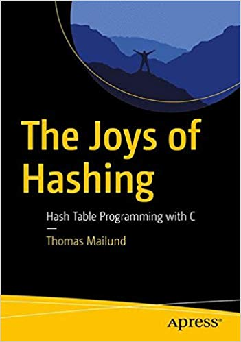

# Various hash tables implemented in C

This repository contains various implementations of hash tables for sets and maps. Each implementation consists of one header and one implementation file, so they are lightweight to add to your own projects. You can find them in the source sub-directories for each of the directories.

To use the tables, just add the source files to your project. All the set implementations have the same name and so do all the map implementations, so you might have to change the names if you need more than one of these.

To cite these implementations, please use [*The Joys of Hashing*](https://amzn.to/2pngZQ0).



## Interface

### Hash sets

Hash sets use three functions as hooks into the implementation.

```c
typedef uint32_t (*hash_func)(void *);
typedef bool (*compare_func)(void *, void *);
typedef void (*destructor_func)(void *);
```

You *must* provide the first two, but you can use 0 for the third. The hash function is used to map application keys to hash keys. For tables that implements universal hashing, the function is still needed to map application keys into hash keys that are them re-scrambled through universal hashing.

The destructor and comparison functions are used to deallocate and compare keys. Do not provide null-pointers here. Nothing good will come from that.

You construct an empty set with this function. The size must be a power of two (God have mercy on your soul if it is not, because the implementation is not merciful). The other three parameters are the functions the table needs.

```c
struct hash_table *
new_set        (uint32_t size, // Must be a power of two!
                 hash_func hash,
                 compare_func cmp,
                 destructor_func destructor);
                    
```

With universal hashing, there is also a `rehash_factor` parameter that determines how often you need to rehash. You have to work this out experimentally.

```c
struct hash_table *
new_set        (uint32_t size, // Must be a power of two!
                float rehash_factor,
                hash_func hash,
                compare_func cmp,
                destructor_func destructor);
```
                
The rest of the interface should be self explanatory.
                
```c
void delete_set  (struct hash_table *table);

void insert_key  (struct hash_table *table,
                  void *key);
bool contains_key(struct hash_table *table,
                  void *key);
void delete_key  (struct hash_table *table,
                  void *key);
```

When you insert a key, the old key is deleted. If you do not want this behaviour, you need to handle it in the destructor. The table cannot know if keys are unique and should be deleted to avoid memory leak, or if they can be the same objects and should not be deleted. You can always check if a key is already in the table before you insert it to avoid deleting existing keys.

### Hash maps

The interface for maps is

```c
struct hash_map *
new_map           (uint32_t size, // Must be a power of two!
                   hash_func hash,
                   compare_func key_cmp,
                   destructor_func key_destructor,
                   destructor_func val_destructor);
void  delete_map  (struct hash_map *table);

void  map          (struct hash_map *table,
                    void *key, void *val);
void *lookup       (struct hash_map *table, void *key);
bool  contains_key (struct hash_map *table, void *key);
void  delete_key   (struct hash_map *table, void *key);
```

For universal hashing the constructor is

```c
struct hash_map *
new_map           (uint32_t size, // Must be a power of two!
                   float rehash_factor,
                   hash_func hash,
                   compare_func key_cmp,
                   destructor_func key_destructor,
                   destructor_func val_destructor);
```

In the constructors, in addition to the functions for sets, you need a value destructor. This function frees memory for the values the hash table maps too.

Other than that, the main change is that insert key is now called map and takes a value argument and that we have an extra function, `lookup` that gets the value for a key. It will return null if the key is not in the table. If you allow null as valid values, you should use `contains_key` to check if a key is in the table.

## Implementations

* [Chained hash set](ChainedHashSet/source) — Hash set with linked lists for conflict resolution.
* [Chained hash set with universal hashing](ChainedUniversalHashSet/source) — What it says on the tin.
* [Linear probe hash set](LinearProbeHashSet/source) — Hash set with open addressing linear probes. If you want double hashing instead, you can replace the probe function with the one below, but linear probing is usually faster for larger hash tables because of its cache efficiency.

```c
static uint32_t
p(uint32_t k, uint32_t i, uint32_t m)
{
    uint32_t h1 = k;
    uint32_t h2 = (k << 1) | 1;
    return (h1 + i*h2) & (m - 1);
}
```

* [Linear probe hash set with universal hashing](LinearProbeUniversalHashSet/source) — Adding universal hashing to linear probe set.

* [Chained hash map](ChainedHashMap/source) — Hash map with linked lists for conflict resolution.
* [Chained hash set with universal hashing](ChainedUniversalHashMap/source) — The same but with universal hashing.
* [Linear probe hash maps](LinearProbeUniversalHashMap/source) — Hash map with linear probing.
* [Linear probe universal hash maps](LinearProbeUniversalHashMap/source) — Guess what this might be.

